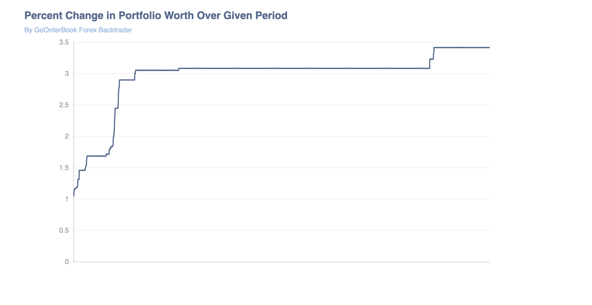

# GoBackTester
This is a backtester written in Golang (and a little python) that uses forex data in order to backtest given trading strategies. Our Data is sourced from truefx.com's historical forex data and supported currencies are listed on their website.
> Update Jan 5, 2023: I have written an example alpha and added a few features like a mean queue, the graph, and other
> things. I did not expect a simple strategy to be so profitable. Hopefully I didn't screw something up to make it this good. Take a look at returns over just two days-

## How to Use:
* You can write your alpha in the baseAlpha.go class and use things like currtime and holdings to influence
decisions. The init is called once and the tradeontime is called every millisecond. Add any trades by creating
a trade object and queueing it to tradeQueue. These will be fulfilled every millisecond.
* To initialize a new alpha, call newAlpha() from main in Orderbook.go. Give time.Time objects for start and end, the
currencies you want, the weights of each currency, and if you want to redownload the data using python script. Place
this in the goroutine and note the supported exchanges below.
>* "audjpy", "audnzd", "audusd", "cadjpy", "chfjpy", "eurchf", "eurgbp", "eurjpy", "eurpln",
  "eurusd", "gbpjpy", "gbpusd", "nzdusd", "usdcad", "usdchf", "usdjpy", "usdmxn", "usdrub", "usdtry", "usdzar"
